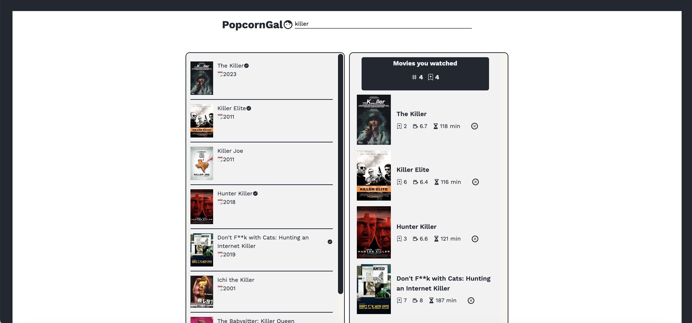

# PopcornGal

> You can search for movies and rate them how much you love.
> You can manage the history of your favourite movies.

## Table of Contents

- [Technologies Used](#technologies-used)
- [Features](#features)
- [Livedemo](#livedemo)
- [Setup](#setup)
- [Room for Improvement](#room-for-improvement)
- [Contact](#contact)
<!-- * [License](#license) -->

## Technologies Used

- HTML
- React
- Vite
- MUI UI
- Tailwind

Data management

- local storage

## Features

- Users can search movies and rate the movies how much they enjoy.
- Uses can keep the list of movie they watched.

<!-- If you have screenshots you'd like to share, include them here. -->

## Live demo


## Setup

- Clone the repository to your local machine.
  https://github.com/yeskwonny/popcorngal.git
- Install dependencies using npm install.
  ```bash
  npm install
  ```
- Run the app using npm start.
  ```bash
  npm run dev
  ```

## Room for Improvement

- Error message displays
- Responsive design for mobile.
- When users click the watched list, shows the movie details.


## Contact

yeahsol.kwon@gmail.com
